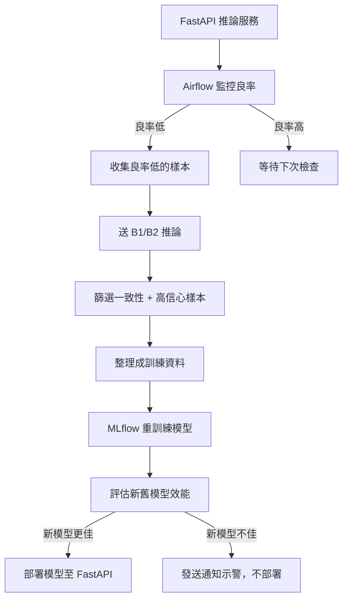
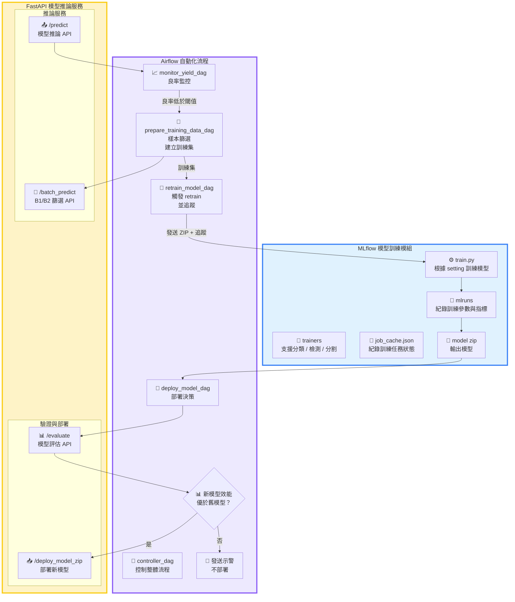

# 🔁 MLOps 自動化模型迭代系統

目標在打造一套完整的 MLOps 模型迭代自動化系統, 模擬產線模型自動化更新：

當推論模型的良率低於設定門檻時，會自動觸發 retrain 流程，包含資料收集、樣本篩選、訓練集準備、模型重新訓練與模型部署，大幅減少人工介入與提升生產穩定性。

---

## 📌 專案特色

* ✅ 自動監控模型良率並觸發 retrain
* 🔁 模型更迭流程全自動：Log Result -> Monitor Metric → Collect Data → Train → Deploy
* 🧠 樣本篩選目前支援雙模型過濾（B1&B2模型預測一致且高信心度）
* 🧪 整合 MLflow 模型記錄與版本控制
* ⚙️ 所有流程皆由 Airflow DAG 控制

---

## 🔄 系統流程圖（System Workflow）




## 🧩 系統架構圖（System Architecture）


---

## 📂 專案結構

```
├── airflow_dags/
│   ├── configs/
│   │   └── monitoring_config.json     # 控制各 DAG 所需參數（如 log 路徑、retrain 門檻等）
│   ├── dags/
│   │   ├── monitor_yield_dag.py           # 分析 FastAPI 推論良率，決定是否 retrain
│   │   ├── prepare_training_data_dag.py   # 根據高信心樣本建立訓練資料集
│   │   ├── retrain_model_dag.py           # 呼叫 retrain API 並追蹤訓練狀態
│   │   ├── deploy_model_dag.py            # 部署 retrain 完的模型到 FastAPI
│   │   ├── production_pipeline_controller_dag.py  # 串接全流程的總控 DAG
│   │   ├── production_line_inference_dag.py       # 模擬產線推論，生成 log
│   │   └── evaluate_model_before_deploy_dags.py # 評估retrain 模型來決定是否部署

│   ├── scripts/
│   │   ├── check_yield.py
│   │   ├── prepare_training_samples.py
│   │   ├── run_simulated_inference.py
│   │   ├── trigger_retrain.py
│   │   ├── deploy_new_model.py
│   │   └── evaluate_model.py
│   ├── globals.py
│   └── schemas.py

├── fastapi_server/
│   ├── run_app.py                     # 啟動 FastAPI 推論服務
│   ├── setting.json                   # 模型推論設定（模型設定、server port等）
│   └── app/
│       ├── app.py                     # API（如 /predict、/reload_model）
│       ├── app_utils.py
│       ├── globals.py
│       └── schemas.py                 # 定義 FastAPI 參數與驗證格式

├── mlflow_tracking/
│   ├── run_app.py                     # 啟動 retrain API 服務
│   ├── setting.json                   # retrain 設定（模型類型、資料來源等）
│   ├── job_cache.json                 # 儲存各 job_id 對應的狀態
│   └── app/
│       ├── app.py                     # retrain 相關 API（如 /start_retrain）
│       ├── app_utils.py
│       ├── globals.py
│       └── schemas.py                 # 定義 retrain API 參數與驗證格式
│   └── training/
│       ├── config.py
│       ├── model_zoo/                # 建立指定模型（分類、檢測、分割）
│       ├── trainers/                 # 對應任務的訓練流程
│       │   ├── classification_trainer.py
│       │   ├── detection_trainer.py
│       │   └── segmentation_trainer.py
│       └── mlflow_utils/
│           └── mlflow_manager.py     # 控制 MLflow 記錄與模型儲存

├── docker-compose.yml
│ 
```

---

## ⚙️ 使用方式

### 👷 Step 1: 啟動服務（建議使用 Docker Compose）

```bash
docker-compose up --build -d
```

執行後，所有服務會自動啟動，包括：

* FastAPI 推論Server（主模型 + 分支模型 B1、B2 + 驗証模型 Eval）

* MLflow 追蹤Server

* Airflow 任務排程器與 Web UI

### ⚙️ Step 2: 操作流程
#### 1. 初始化資料庫，設定自已的帳密後，開啟瀏覽器，前往 Airflow UI：

* 初始化資料庫
```bash
docker-compose exec airflow-webserver airflow db init
```

* 設定自已的帳密
```bash
 docker-compose exec airflow-webserver airflow users create  --username <your-account>  --password <your-secret>  --firstname airflow  --lastname airflow  --role Admin  --email airflow@example.com

```

* 開啟瀏覽器，前往 Airflow UI
```bash
http://<your-ip>:8080
```


#### 2.登入 Airflow（預設帳號密碼如下）：

| 帳號      | 密碼      |
| ------- | ------- |
| your-account | your-secret |


#### 3.執行主控制 DAG：
```bash
production_pipeline_controller_dag
```

該 DAG 將自動串接以下流程：

* monitor_yield_dag：監控模型推論良率

* prepare_training_data_dag：自動抽樣高信心資料

* retrain_model_dag：重新訓練模型並記錄至 MLflow

* evaluate_model_before_deploy_dags.py：評估訓練後的模型來決定是否部署

* deploy_model_dag：自動部署新模型到 FastAPI


📌 預設服務 Port 一覽
| 服務名稱            | 預設 Port |
| --------------- | ------- |
| FastAPI 主模型     | 8010    |
| FastAPI 模型 B1   | 8011    |
| FastAPI 模型 B2   | 8012    |
| FastAPI 模型 Eval   | 8016    |
| MLflow Tracking | 5000    |
| Airflow Web UI  | 8080    |


---

## 🔧 Airflow 設定檔說明

### `monitoring_config.json`

```jsonc
{
    "production_line": {
        "inference_server_api": "http://host.docker.internal:8010/predict",
        "inference_image_dir": "./data/val",
        "repeat": 1
    },
    "monitor": {
        "yield_threshold": 0.7,
        "recent_window": 29,
        "yield_drop_tolerance": 0.05,
        "log_path": "./resources/inference_logs_8010.csv",
        "flag_path": "./resources/flags/need_retrain.flag",
        "monitor_delay_sec": 30
    },
    "prepare_training_data": {
        "inference_image_dir": "./data/val",
        "selected_sample_dir": "./data/selected_recent_samples",
        "training_template_path": "configs/training_template.json",
        "final_training_zip": "./data/train_package.zip",
        "merge_with_previous": "./data/train",
        "b1_inference_api": "http://host.docker.internal:8011/batch_predict",
        "b2_inference_api": "http://host.docker.internal:8012/batch_predict",
        "confidence_threshold": 0.7,
        "val_ratio": 0.1
    },
    "retrain": {
        "retrain_server_api": "http://host.docker.internal:8020",
        "max_wait_sec": 600,
        "poll_interval_sec": 10
    },
    "evaluate_before_deploy": {
        "image_dir_or_zip": "./data/test.zip",
        "eval_inference_api": "http://host.docker.internal:8016/evaluate",
        "metric": "accuracy",
        "min_improvement": 0.01,
        "old_model_api": "http://host.docker.internal:8010/export_model",
        "new_model_api": "http://host.docker.internal:8020/download_model",
        "result_flag_path": "./resources/flags/evaluate_result.json"
    },
    "deploy": {
        "inference_server_api": "http://host.docker.internal:8010/deploy_model_zip",
        "job_id_to_deploy": "fa1a7096-cccf-4f8f-a196-b518ac8c581d"
    }
}
```
🔍 關鍵參數說明
| 參數                                                            | 說明                                                    |
| ------------------------------------------------------------- | ----------------------------------------------------- |
| `monitor.yield_threshold`                                     | 低於此值則視為模型效能下降，觸發自動訓練（retrain）。                        |
| `monitor.recent_window`                                       | 評估良率時使用的推論樣本數量（近期 N 筆）。                             |
| `prepare_training_data.b1_inference_api` / `b2_inference_api` | 使用兩個模型 API 進行交叉驗證，選出高一致性、高信心樣本。                       |
| `prepare_training_data.confidence_threshold`                  | 模型預測機率需超過此門檻才視為「高信心」樣本。                               |
| `prepare_training_data.merge_with_previous`                   | 若指定資料夾路徑，將新抽樣資料與舊訓練集合併（含影像與標註 CSV）。                   |
| `prepare_training_data.training_template_path`                | 訓練setting.json樣板設定。                    |
| `retrain.retrain_server_api`                                  | retrain 所使用的後端服務 API 端點（由 mlflow_tracking 提供）。 |
| `deploy.job_id_to_deploy`                                     | 指定要部署的訓練成果（對應 retrain 產出的 `job_id` 與壓縮模型）。            |

---

## 📈 下一步：
* ❌ ~~原本直接部署模型，已改為先驗證再決定部署~~
* ✨ 支援K8S部署
* ✨ 支援Github Actions CI/CD
* ✨ 客製化分類資料集教學文件
* ✨ 分類任務的實驗紀錄
* ✨ 支援Email示警
* ✨ 支援不同模型(Object Detection 、Segmentation)
* ✨ 支援不同訓練樣本選擇方式
* ✨ 更細拆分Airflow 流程並模組化，可更好客制化流程

---

## 🧑‍💼 貢獻方式

歡迎提出 PR 或開 Issue 參與此專案優化！請確保格式與模組化設計一致。

---

## 📄 License

MIT License

---
